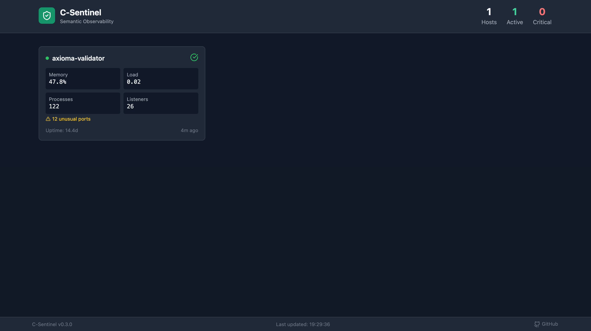

# C-Sentinel

**Semantic Observability for UNIX Systems**

A lightweight, portable system prober written in C that captures "system fingerprints" for AI-assisted analysis of non-obvious risks. Now with a live web dashboard.

[](https://opensource.org/licenses/MIT)


**Live Demo**: [sentinel.speytech.com](https://sentinel.speytech.com)



## What's New in v0.3.0

- 🖥️ **Web Dashboard** - Real-time multi-host monitoring with charts
- 🔐 **SHA256 Checksums** - Cryptographic config integrity verification
- 🔧 **Systemd Service** - Production-ready deployment with security hardening
- 🧠 **Baseline Learning** - Teach Sentinel what "normal" looks like, detect deviations
- 🌐 **Network Probe** - Monitor listening ports, established connections, unusual services
- 👁️ **Watch Mode** - Continuous monitoring with configurable intervals
- ⚙️ **Config File** - `~/.sentinel/config` for API keys, thresholds, webhooks
- 🔔 **Webhook Alerts** - Slack/Discord notifications on critical findings
- 📊 **Exit Codes** - CI/CD integration (0=OK, 1=WARN, 2=CRITICAL)

## The Problem

Modern observability tools like Dynatrace, Datadog, and Prometheus are excellent at metric collection and threshold alerting. But they answer a narrow question: *"Is this metric outside its expected range?"*

They struggle with:
- **Causal reasoning**: *Why* did something fail?
- **Context synthesis**: Connecting a config change last week to today's latency spike
- **Non-obvious degradation**: Things that aren't "broken" but are drifting toward failure
- **The "silent drift"**: Two servers that should be identical but have subtly diverged

C-Sentinel takes a different approach: capture a comprehensive system fingerprint and use LLM reasoning to identify the "ghosts in the machine."

## Quick Start

```bash
# Clone and build
git clone https://github.com/williamofai/c-sentinel.git
cd c-sentinel
make

# Quick analysis
./bin/sentinel --quick --network

# Learn what's "normal" for this system
./bin/sentinel --learn --network

# Later, detect deviations from normal
./bin/sentinel --baseline --network

# Continuous monitoring (every 5 minutes)
./bin/sentinel --watch --interval 300 --network

# Full AI-powered analysis
export ANTHROPIC_API_KEY="your-key"
./bin/sentinel --json --network | python3 sentinel_analyze.py
```

## Web Dashboard

C-Sentinel includes a web dashboard for monitoring multiple hosts in real-time.


### Features

- **Real-time host monitoring** - See all hosts at a glance
- **Historical charts** - Memory and load over 24 hours  
- **Network view** - All listening ports and connections
- **Config tracking** - SHA256 checksums of monitored files
- **Multi-host support** - Monitor your entire fleet

### Quick Setup

```bash
# Install dashboard
cd dashboard
sudo ./install-dashboard.sh

# Configure agent to report
*/5 * * * * /usr/local/bin/sentinel --json --network | curl -s -X POST \
  -H "Content-Type: application/json" \
  -H "X-API-Key: YOUR_KEY" \
  -d @- https://your-dashboard.com/api/ingest
```

See [dashboard/README.md](dashboard/README.md) for full setup instructions.

## Systemd Service

For production deployment, C-Sentinel includes a systemd service unit:

```bash
# Install
sudo ./install.sh

# Enable and start
sudo systemctl enable sentinel
sudo systemctl start sentinel

# Check status
sudo journalctl -u sentinel -f
```

Features:
- Runs as dedicated `sentinel` user
- Security hardening (NoNewPrivileges, ProtectSystem, PrivateTmp)
- Automatic restart on failure
- Exit codes 0, 1, 2 treated as success (only errors trigger restart)

See [deploy/README.md](deploy/) for details.

## Example Output

### Quick Analysis with Network
```
C-Sentinel Quick Analysis
========================
Hostname: axioma-validator
Uptime: 14.3 days
Load: 0.09 0.04 0.00
Memory: 46.4% used
Processes: 122 total

Potential Issues:
  Zombie processes: 0
  High FD processes: 0
  Long-running (>7d): 97
  Config permission issues: 0

Network:
  Listening ports: 26
  Established connections: 13
  Unusual ports: 12 ⚠

  Listeners:
    127.0.0.54:53 (tcp) - systemd-resolved
    0.0.0.0:80 (tcp) - nginx
    0.0.0.0:22 (tcp) - sshd
    0.0.0.0:443 (tcp) - nginx
    127.0.0.1:5432 (tcp) - postgres
    127.0.0.1:11434 (tcp) - ollama
    ... and 20 more
```

### Baseline Comparison
```
Baseline Comparison
══════════════════════════════════════════════════
Baseline created: Thu Jan  2 15:45:00 2026
Samples learned: 5
Expected ports: 13
Tracked configs: 5

✓ System matches baseline - no deviations detected
```

### Deviation Detection
```
Baseline Comparison
══════════════════════════════════════════════════
⚠ DEVIATIONS DETECTED: 2
──────────────────────────────────────────────────
• NEW LISTENERS (1): 4444
• CONFIG CHANGES (1):
    - /etc/ssh/sshd_config (SHA256 mismatch)
```

## Features

| Feature | Command | Description |
|---------|---------|-------------|
| Quick analysis | `--quick` | Human-readable summary |
| Network probe | `--network` | Listening ports & connections |
| Watch mode | `--watch --interval 60` | Continuous monitoring |
| Baseline learn | `--learn` | Save current state as "normal" |
| Baseline compare | `--baseline` | Detect deviations |
| JSON output | `--json` | Full fingerprint for LLM/dashboard |
| Config | `--config` | Show current settings |

### Exit Codes (for CI/CD)

| Code | Meaning |
|------|---------|
| 0 | No issues detected |
| 1 | Warnings (minor issues) |
| 2 | Critical (zombies, permission issues, unusual ports) |
| 3 | Error (probe failed) |

## Configuration

Create a config file with `./bin/sentinel --init-config`, then edit `~/.sentinel/config`:

```ini
# API Keys
anthropic_api_key = sk-ant-...
ollama_host = http://localhost:11434

# Default AI model: claude, openai, or ollama
default_model = claude
ollama_model = llama3.2:3b

# Thresholds
zombie_threshold = 0
high_fd_threshold = 100
unusual_port_threshold = 3
memory_warn_percent = 80.0
memory_crit_percent = 95.0

# Webhook (Slack-compatible)
webhook_url = https://hooks.slack.com/services/...
webhook_on_critical = true
webhook_on_warning = false

# Watch mode defaults
default_interval = 60
network_by_default = false
```

## Architecture

```
┌─────────────────────────────────────────────────────────────┐
│                      Web Dashboard                          │
│  • Multi-host view          • Historical charts             │
│  • Network listeners        • Config checksums              │
└─────────────────────────────────────────────────────────────┘
                              ▲
                              │ JSON via HTTP POST
                              │
┌─────────────────────────────────────────────────────────────┐
│                    Python Orchestration                      │
│  • API communication        • Response parsing              │
│  • Policy validation        • User interface                │
└─────────────────────────────────────────────────────────────┘
                              │
                              ▼
┌─────────────────────────────────────────────────────────────┐
│                     C Foundation                             │
│  • /proc parsing            • SHA256 checksums              │
│  • Process analysis         • Drift detection               │
│  • Network probing          • Baseline learning             │
└─────────────────────────────────────────────────────────────┘
```

### Why C?

| Concern | Python | C |
|---------|--------|---|
| **Dependencies** | Requires Python runtime (~100MB) | Static binary (~76KB) |
| **Startup time** | ~500ms interpreter startup | ~1ms |
| **Memory** | ~30MB baseline | <2MB |
| **Portability** | Needs matching Python version | Runs on any POSIX system |

When you're probing a struggling production server, the last thing you want is your diagnostic tool consuming resources.

## What It Captures

| Category | Data | Purpose |
|----------|------|---------|
| System | Hostname, kernel, uptime, load, memory | Basic health context |
| Processes | Notable processes with metadata | Zombie, leak, stuck detection |
| Configs | File metadata + SHA256 checksums | Cryptographic drift detection |
| Network | Listeners, connections, ports | Service monitoring |

## What It Flags

- 🧟 **Zombie processes**: Always a problem
- 📂 **High FD counts**: Potential descriptor leaks (>100 open)
- ⏰ **Long-running processes**: >7 days without restart
- 🔓 **Permission issues**: World-writable configs
- 💾 **Memory hogs**: Processes >1GB RSS
- 🌐 **Unusual ports**: Services not in common ports list
- 📡 **New listeners**: Ports that weren't in baseline
- ❌ **Missing services**: Expected ports that stopped listening
- 🔐 **Config drift**: SHA256 checksum changes

## AI Integration

```bash
# With Anthropic Claude (cloud)
export ANTHROPIC_API_KEY="your-key"
./bin/sentinel --json --network | python3 sentinel_analyze.py

# With Ollama (local, free, private)
ollama pull llama3.2:3b
./bin/sentinel --json --network | python3 sentinel_analyze.py --local
```

The Python wrapper includes:
- **Policy Engine**: Validates AI suggestions before display
- **Sanitizer**: Strips IPs, secrets, and PII before API transmission
- **Safe command detection**: Blocks dangerous commands regardless of AI reasoning

## Building

```bash
make              # Release build
make DEBUG=1      # Debug build with symbols
make test         # Run basic tests
make install      # Install to /usr/local/bin
```

### Requirements
- GCC or Clang with C99 support
- GNU Make
- Linux (uses `/proc` filesystem)

## Project Structure

```
c-sentinel/
├── include/
│   └── sentinel.h        # Core data structures & types
├── src/
│   ├── main.c            # CLI entry point
│   ├── prober.c          # System probing (/proc)
│   ├── net_probe.c       # Network probing (/proc/net)
│   ├── baseline.c        # Baseline learning & comparison
│   ├── config.c          # Config file parsing
│   ├── alert.c           # Webhook alerting
│   ├── sha256.c          # Pure C SHA256 implementation
│   ├── json_serialize.c  # JSON output generation
│   ├── policy.c          # Command validation engine
│   ├── sanitize.c        # PII/secret stripping
│   └── diff.c            # Fingerprint comparison
├── deploy/
│   ├── sentinel.service  # Systemd unit file
│   ├── install.sh        # Installation script
│   └── uninstall.sh      # Clean removal
├── dashboard/
│   ├── app.py            # Flask dashboard
│   ├── templates/        # HTML templates
│   ├── install-dashboard.sh
│   └── README.md
├── docs/
│   └── AUDIT_SPEC.md     # Auditd integration specification
├── sentinel_analyze.py   # Python wrapper for LLM
├── Makefile
├── README.md
├── DESIGN_DECISIONS.md
└── LICENSE
```

## Roadmap

### Completed ✅
- [x] Core system prober
- [x] JSON serialization  
- [x] Policy engine (command validation)
- [x] Sanitizer (PII stripping)
- [x] Drift detection (sentinel-diff)
- [x] Python wrapper with Claude integration
- [x] Network probing
- [x] Watch mode
- [x] Baseline learning
- [x] Config file support
- [x] Webhook alerts
- [x] SHA256 checksums
- [x] Systemd service unit
- [x] Web dashboard
- [x] Multi-host aggregation

### In Progress 🔨
- [ ] Auditd integration - Security event summarisation with process ancestry ([spec](docs/AUDIT_SPEC.md))

### Planned 📋
- [ ] Dashboard authentication
- [ ] Email alerts
- [ ] Plugin system for application-specific probes
- [ ] FreeBSD/macOS support
- [ ] Docker compose for dashboard

## Contributing

Contributions welcome! Areas of particular interest:

- **Platform support**: BSD, macOS, Solaris
- **Application probers**: nginx, postgres, redis, etc.
- **Sanitization patterns**: Help identify sensitive data patterns
- **Test coverage**: Edge cases and failure modes
- **Dashboard enhancements**: Charts, alerts, mobile responsiveness

See [CONTRIBUTING.md](CONTRIBUTING.md) for guidelines.

## License

MIT License - see [LICENSE](LICENSE) for details.

## Author

**William Murray** - 30 years UNIX systems engineering

- GitHub: [@williamofai](https://github.com/williamofai)
- LinkedIn: [William Murray](https://www.linkedin.com/in/william-murray-5180aa32b/)
- Website: [speytech.com](https://speytech.com)

---

*"The goal isn't to replace monitoring tools—it's to add wisdom to their data."*
